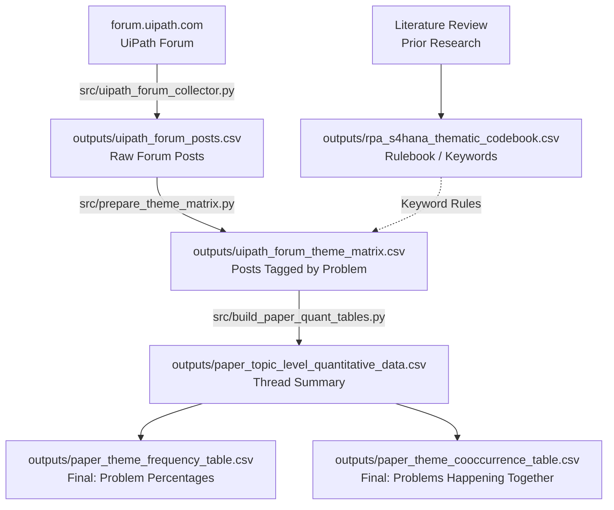

# What Breaks RPA Bots When SAP Upgrades? (SAP S/4HANA Migration Study)

A simple Python data pipeline that analyzes real-world discussions from the UiPath Community Forum to find out **why software bots break when companies upgrade to SAP S/4HANA**, and how engineers fix them.

---

## The Problem in Plain English

Many companies rely on **Robotic Process Automation (RPA)** bots—like UiPath—to automate repetitive tasks in SAP (such as entering invoices, processing orders, and pulling reports). 

When these companies upgrade from older SAP (ECC) to modern SAP (S/4HANA), **their bots suddenly break**. Here is why:

1. **Buttons & Screens Move:** Older desktop screens are replaced with modern web apps (SAP Fiori). Buttons, input fields, and menus change position or code, so bots click on empty space.
2. **Old Shortcuts Disappear:** Classic transaction shortcuts are retired or merged into new screens, so the bot's navigation paths fail.
3. **Bots Get Locked Out:** Security settings and scripting permissions are often reset during the upgrade, blocking bots from logging in.
4. **Underlying Data Changes:** SAP changes its database tables and APIs. If a bot expects data in an old format, it crashes or pulls blank fields.

Because companies rarely publish their internal bot failures, this project looks at **real developer discussions on the UiPath Community Forum** to uncover the most common points of failure and what it takes to fix them.

---

## What Data Are You Looking At & Why?

All data is stored in the `outputs/` folder, organized into three simple stages:

```
┌──────────────────────────────────────────────────────────────────────────────────────────────────┐
│                                WHAT DATA YOU ARE LOOKING AT & WHY                                │
├────────────────────────────────────────────────┬─────────────────────────────────────────────────┤
│ STAGE 1: THE INPUTS                            │ STAGE 3: THE FINAL RESULTS                      │
│                                                │                                                 │
│ uipath_forum_posts.csv (and .jsonl)            │ paper_theme_frequency_table.csv                 │
│ • WHAT: Raw forum posts from real developers.  │ • WHAT: Percentage breakdown of problems.       │
│ • WHY: Real-world evidence of where bots break.│ • WHY: Shows which failure types happen most.   │
│                                                │                                                 │
│ rpa_s4hana_thematic_codebook.csv               │ paper_theme_cooccurrence_table.csv              │
│ • WHAT: A rulebook of keywords to look for.    │ • WHAT: Which problems happen together.         │
│ • WHY: Tells the script how to classify bugs.  │ • WHY: Shows how small UI bugs compound into    │
│                                                │   major rework for engineering teams.           │
├────────────────────────────────────────────────┴─────────────────────────────────────────────────┤
│ STAGE 2: INTERMEDIATE MATH (BEHIND-THE-SCENES)                                                   │
│                                                                                                  │
│ • uipath_forum_theme_matrix.csv: Posts marked with 1 or 0 when keywords match.                   │
│ • paper_topic_level_quantitative_data.csv: Replies grouped back into full conversation threads.  │
└──────────────────────────────────────────────────────────────────────────────────────────────────┘
```

### Quick Guide to Every File

| File Name | What It Is | Why It Matters |
| :--- | :--- | :--- |
| **`outputs/uipath_forum_posts.csv`** | **Raw Forum Posts:** The unedited text, dates, views, and replies downloaded from the UiPath Community Forum. | Gives us the raw, unfiltered proof of real problems faced by developers. |
| **`outputs/rpa_s4hana_thematic_codebook.csv`** | **The Rulebook:** Definitions and search keywords for the 8 problem categories ($T1$ through $T8$). | Tells our Python script what words mean what problem. |
| **`outputs/uipath_forum_theme_matrix.csv`** | **Tagged Posts (Intermediate):** The forum posts with `1` or `0` checkmarks for each matched problem keyword. | Converts human chat into numbers so we can do statistics. |
| **`outputs/paper_topic_level_quantitative_data.csv`** | **Thread Summary (Intermediate):** Groups replies together into complete conversation threads. | Keeps bug reports, troubleshooting, and final solutions linked together. |
| **`outputs/paper_theme_frequency_table.csv`** | **Problem Scorecard (Final):** The total count and percentage of discussions for each problem type. | Proves which issues are most common (e.g., UI breaks account for over 50% of complaints). |
| **`outputs/paper_theme_cooccurrence_table.csv`** | **Problem Pairs (Final):** Shows which problems tend to occur in the exact same discussion. | Proves that superficial UI errors quickly trigger major redevelopment work. |

---

## The 8 Problem Themes We Track (T1–T8)

| Code | Problem Category | Plain-English Meaning |
| :--- | :--- | :--- |
| **T1** | **Buttons & Screens Changed** | Screen layouts changed or buttons moved, so the bot cannot find where to click. |
| **T2** | **Backend / Database Changed** | SAP changed an old transaction code or database table, breaking bot data lookups. |
| **T3** | **Bot Got Locked Out** | Single Sign-On (SSO), passwords, or user permissions broke during the migration. |
| **T4** | **Timeouts & Freezing** | SAP runs slower or faster than expected, causing the bot to freeze or time out. |
| **T5** | **How Developers Fixed It** | The actual technical fixes: switching to APIs, updating selectors, or rewriting scripts. |
| **T6** | **Team Coordination** | Testing schedules, project sign-offs, and coordination between SAP and RPA teams. |
| **T7** | **Business Damage** | The real-world consequences: invoice backlogs, bot downtime, and lost hours. |
| **T8** | **Keep it or Kill it?** | Deciding whether to repair the old bot, rebuild it from scratch, or retire it. |

---

## Data Pipeline & Architecture

The files in `outputs/` are generated across four sequential stages:



---

## Project Structure

```
├── .gitignore                   # Excludes __pycache__, .DS_Store, and virtualenvs
├── README.md                    # Project documentation & data guide
├── requirements.txt             # Python dependencies
├── run_pipeline.py              # Master CLI script to run pipeline steps end-to-end
├── src/                         # Source scripts
│   ├── uipath_forum_collector.py       # Step 1: Scrapes forum topics and posts via Discourse API
│   ├── prepare_theme_matrix.py         # Step 2: Generates the 8-theme coding matrix
│   ├── build_paper_quant_tables.py     # Step 3: Aggregates topics and builds frequency tables
│   ├── analyze_csvs.py                 # Step 4: Computes dataset summary diagnostics
│   ├── reddit_api_collector.py         # Optional Reddit scraper (PRAW)
│   └── build_reddit_paper_quant_tables.py
└── outputs/                     # Datasets, codebook, and dataset guide
    ├── README.md                       # Dedicated guide explaining all CSV tables & connections
    ├── uipath_forum_posts.csv          # Raw scraped forum posts
    ├── uipath_forum_theme_matrix.csv   # Thematic feature matrix (T1-T8)
    ├── paper_topic_level_quantitative_data.csv
    ├── paper_theme_frequency_table.csv
    ├── paper_theme_cooccurrence_table.csv
    └── rpa_s4hana_thematic_codebook.csv
```

---

## Setup & Execution

### Install Dependencies
```bash
pip install -r requirements.txt
```

### Run the Pipeline
```bash
# Run all steps end-to-end
python3 run_pipeline.py --all

# Or run analysis only using existing scraped data
python3 run_pipeline.py --step 2 3 4

# Dry-run mode (view execution plan without running scripts)
python3 run_pipeline.py --dry-run
```

---

## Git Commit

To commit this repository cleanly to Git:

```bash
cd "/Users/anishsanchith/Documents/Codex/2026-06-22/i-need-to-web-scrape-things"
git add .
git status
git commit -m "feat: complete data pipeline and documentation for RPA SAP S/4HANA migration"
```
