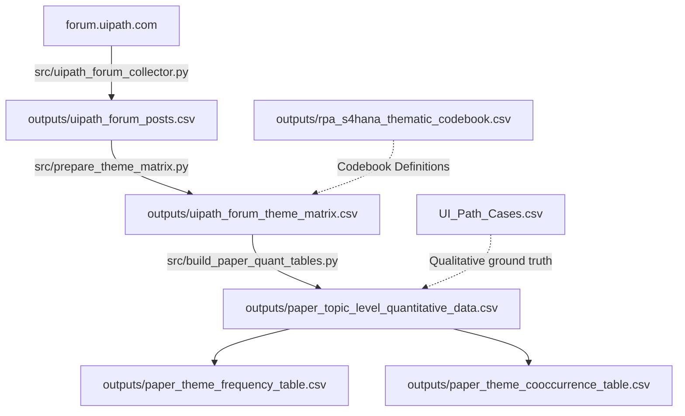

# RPA Bot Adaptation after SAP S/4HANA Migration

A Python scraping, thematic coding, and empirical analysis pipeline investigating how Robotic Process Automation (RPA / UiPath) bots fail and adapt when enterprises migrate from SAP ECC to SAP S/4HANA, the operational challenges that emerge, and how future automations can be designed for resilience.

---

## Research Questions & Thematic Scope

This repository provides the empirical data, coding matrices, and reproducible pipeline to answer three core research questions:

### RQ1: How can backend system changes affect existing RPA bots?
* **Process changes:** Deprecation of classic transaction codes (e.g., `XD01`/`XK01` consolidated into Business Partner `BP`) and the shift from scheduled `SM37` batch processing to synchronous real-time posting.
* **User Interface changes:** Transition from classic desktop WinGUI to web-based SAP Fiori; dynamic SAPUI5 DOM IDs (`__xmlview3--...`); Belize/Quartz theme shifts altering control hierarchy trees; virtualized lazy-loaded tables.
* **Permission changes:** SAP Basis resetting server parameter `sapgui/user_scripting` to `FALSE` in `RZ11` during server upgrades; revoked RFC and `S_TABU_DIS` authorizations on robot service accounts; interactive script attachment warning modals.
* **System dependencies:** Outdated middleware connectors (e.g., .NET `SAP_NCo` failing on S/4HANA BAPI metadata); Studio framework deprecations (e.g., dropping `ViewStateManager` in modern XAML); browser migrations (IE to Chrome/Edge).

### RQ2: What challenges arise when existing RPA bots need to be adapted after backend system changes?
* **Outdated design assumptions:** Bots originally built assuming static window titles, fixed screen coordinates, persistent element tags, and 18-character material fields (`MATNR`) failing when S/4 introduces responsive DOMs and 40-character field extensions.
* **Adaptation effort:** The "Band-Aid Patch Trap"—teams spending hundreds of hours tweaking brittle UI selectors rather than re-architecting, forcing end-to-end re-testing across dozens of projects for minor interface changes.
* **Maintenance burden:** Performance regressions (bots executing 25% slower on newer GUI versions with zero workflow code change); database lock collisions (`FOREIGN_LOCK`) during concurrent real-time posting.
* **Employee concerns:** Operational panic during cutover; digital workforce paralysis creating multi-thousand-order backlogs; emergency deployment of manual temporary staff to handle fallback processing.

### RQ3: How can RPA bots and adaptation initiatives be designed to be less affected by future backend system changes?
* **Low-impact RPA artifacts:** Decoupled, headless automation using native SAP connectors, BAPIs (`BAPI_PO_CREATE1`, `BAPI_ACC_DOCUMENT_POST`), and OData endpoints rather than surface-level UI clicking.
* **Dependency documentation:** Comprehensive bot asset inventories mapping T-code, BAPI, database table, and Basis parameter dependencies before migration cutover.
* **Testing:** Continuous regression testing using automated synthetic test bots in the S/4HANA preview/staging sandbox 30 days prior to go-live; SAP Change Impact Mining to test only modified transactions.
* **Sustainable and reliable adaptation process:** A structured 3-way triage matrix: **Retire** redundant bots (25%), **Rebuild** high-volume bots with APIs (60%), and **Refactor** low-risk UI bots (15%); Orchestrator Queues with exponential retry logic to eliminate lock collisions.

---

## Research Questions to Data & Code Mapping

| Research Question | Sub-Theme | Scraped Theme / Factor in Dataset | Key File & Empirical Grounding |
| :--- | :--- | :--- | :--- |
| **RQ1: Backend Effects** | Process changes | `T2_data_model_transaction_change`<br>`T4_timing_reliability` | `UI_Path_Cases.csv` (Cases 8, 10, 11)<br>`uipath_forum_posts.csv` |
| | UI changes | `T1_ui_selector_breakage`<br>`mentions_fiori`, `mentions_sap_gui` | `UI_Path_Cases.csv` (Cases 1, 2, 4)<br>`uipath_forum_theme_matrix.csv` |
| | Permission changes | `T3_auth_landscape_access` | `UI_Path_Cases.csv` (Case 7)<br>`uipath_forum_posts.csv` (`RZ11` resets) |
| | System dependencies | `T2_data_model_transaction_change`<br>`T5_adaptation_method` | `UI_Path_Cases.csv` (Case 3 - `SAP_NCo` hang)<br>`uipath_forum_posts.csv` (XAML formats) |
| **RQ2: Adaptation Challenges** | Outdated design assumptions | `T1_ui_selector_breakage`<br>`T8_strategy_decision` | `uipath_forum_theme_matrix.csv`<br>`paper_topic_level_quantitative_data.csv` |
| | Adaptation effort | `T7_business_impact`<br>`T5_adaptation_method` | `UI_Path_Cases.csv` (Case 1 - 35 projects re-tested)<br>`paper_theme_frequency_table.csv` |
| | Maintenance burden | `T4_timing_reliability`<br>`T7_business_impact` | `UI_Path_Cases.csv` (Case 6 - 25% slowdown)<br>`paper_theme_cooccurrence_table.csv` |
| | Employee concerns | `T7_business_impact`<br>`T6_governance_change_mgmt` | `uipath_forum_posts.csv` (Backlog & temp worker costs)<br>`csv_analysis_summary.md` |
| **RQ3: Resilient Design** | Low-impact artifacts | `T5_adaptation_method`<br>`T8_strategy_decision` | `UI_Path_Cases.csv` (Cases 1 & 3 resolutions)<br>`uipath_forum_theme_matrix.csv` (BAPI/OData) |
| | Dependency documentation | `T6_governance_change_mgmt` | `outputs/rpa_s4hana_thematic_codebook.csv`<br>`paper_quantitative_results.md` |
| | Testing | `T5_adaptation_method`<br>`T6_governance_change_mgmt` | `uipath_forum_posts.csv` (QuidelOrtho & EDF testing cases)<br>`paper_theme_frequency_table.csv` |
| | Sustainable process | `T8_strategy_decision`<br>`T6_governance_change_mgmt` | `paper_topic_level_quantitative_data.csv`<br>`outputs/paper_quantitative_results.md` |

---

## What Factors Were Scraped & Why

The scraper targets public discussion threads on `forum.uipath.com` using Discourse REST API endpoints (`/search.json` and `/t/{slug}/{id}.json`). It captures the following data fields:

| Field | Description | Why It Was Scraped |
|---|---|---|
| `topic_id`, `post_id` | Thread & post identifiers | **Preserves Conversational Context:** Technical troubleshooting is dialogic. The initial post reports the symptom (e.g., selector exception), while subsequent replies reveal the root cause (e.g., an `RZ11` parameter change) and verified resolution. |
| `author_hash` | SHA-256 hashed username | **Privacy & Ethics:** Anonymizes user handles (`hashlib.sha256(username).hexdigest()[:16]`) for research ethics and GDPR compliance, while allowing us to track unique contributors across threads. |
| `created_at` | Post timestamp | **Temporal Mapping:** Allows mapping discussions against the peak S/4HANA enterprise migration wave (2020–2025). |
| `views`, `reply_count`, `like_count` | Engagement metrics | **Severity & Resonance Proxy:** High view and reply counts indicate widespread enterprise friction versus isolated edge cases. |
| `title`, `text` | Cleaned textual content | Stripped of HTML markup, code blocks, and formatting for keyword matching, NLP feature extraction, and verbatim quote grounding. |
| `mentions_*` | Flags for SAP terms (`s4hana`, `fiori`, `sap_gui`, `uipath`) | **Architectural Layer Tagging:** Identifies which layer of the SAP technology stack is involved (classic desktop WinGUI vs. web Fiori Launchpad). |
| `word_count` | Post word count | **Noise Filter:** Filters out low-information replies (e.g., one-line *"thanks"* posts) from rich diagnostic discussions. |

---

## The 8 Thematic Codes (T1–T8)

Posts are categorized using an 8-theme codebook ([`outputs/rpa_s4hana_thematic_codebook.csv`](outputs/rpa_s4hana_thematic_codebook.csv)):

* **T1: UI & Selector Breakage:** Dynamic UI5 wrapper IDs, theme updates (Belize/Quartz), and iframe sandbox issues breaking UI selectors (`aaname`, `id`).
* **T2: Data Model & Transaction Changes:** Deprecated transaction codes (`XD01`/`XK01`), consolidated database tables (`ACDOCA`), and migration to BAPIs/OData.
* **T3: Auth, Landscape & Access:** Basis parameter resets (`RZ11`), revoked RFC authorizations, SSO/MFA hurdles, and sandbox vs. production configuration mismatches.
* **T4: Timing & Reliability:** Execution timeouts, elimination of scheduled SM37 batch jobs, and concurrent bot lock collisions (`FOREIGN_LOCK`).
* **T5: Adaptation Method:** Concrete engineering remediations—rebuilding via BAPIs, implementing fuzzy/anchor selectors, rewriting workflows, or executing test suites.
* **T6: Governance & Change Management:** CoE policies, UAT sign-offs, change freezes, bot inventories, and hypercare coordination.
* **T7: Business Impact:** Tangible operational consequences—manual fallback costs, temporary staffing, order backlogs, and downtime hours.
* **T8: Strategy Decision:** Strategic triage choices—decisions to retire redundant automations, rebuild using APIs, or patch existing UI workflows.

---

## Data Pipeline & CSV Relationships

The CSV files in `outputs/` are generated across four sequential stages:



### Relational Schema

| File | Primary Key | Link Key | Level | Description |
|---|---|---|---|---|
| `uipath_forum_posts.csv` | `post_id` | `topic_id` | Post | Raw text, views, reply counts, and hashed authors scraped from the forum. |
| `uipath_forum_theme_matrix.csv` | `post_id` | `topic_id` | Post | 1-to-1 extension adding `word_count`, `mentions_*`, and binary indicators for `T1` through `T8`. |
| `paper_topic_level_quantitative_data.csv` | `topic_id` | `topic_id` | Topic | Posts rolled up into complete thread units, scored by relevance (0 to 3). |
| `paper_theme_frequency_table.csv` | `theme_id` | `theme_id` | Theme | Overall frequency and percentage of each theme across posts and topics. |
| `paper_theme_cooccurrence_table.csv` | `theme_a`, `theme_b` | `theme_id` | Theme Pair | Pairwise matrix showing which problems co-occur in the same discussions. |
| `rpa_s4hana_thematic_codebook.csv` | `theme_id` | `theme_id` | Theme | Formal codebook with definitions, inclusion rules, and example keywords. |
| `UI_Path_Cases.csv` | `case_id` | `url` $\to$ `topic_id` | Case | 15 curated incident vignettes with verbatim developer quotes and resolutions. |

---

## Project Structure

```
├── .gitignore                   # Excludes __pycache__, .DS_Store, and virtualenvs
├── README.md                    # Project documentation & research mapping
├── requirements.txt             # Python dependencies
├── run_pipeline.py              # Master CLI script to run pipeline steps
├── src/                         # Pipeline source scripts
│   ├── uipath_forum_collector.py       # Step 1: Scrapes forum topics and posts
│   ├── prepare_theme_matrix.py         # Step 2: Generates the 8-theme coding matrix
│   ├── build_paper_quant_tables.py     # Step 3: Aggregates topics and builds frequency tables
│   ├── analyze_csvs.py                 # Step 4: Generates summary statistics and reports
│   ├── reddit_api_collector.py         # Optional Reddit scraper (PRAW)
│   └── build_reddit_paper_quant_tables.py
└── outputs/                     # Processed datasets and reports
    ├── uipath_forum_posts.csv          # Raw scraped forum posts
    ├── uipath_forum_theme_matrix.csv   # Thematic feature matrix (T1-T8)
    ├── paper_topic_level_quantitative_data.csv
    ├── paper_theme_frequency_table.csv
    ├── paper_theme_cooccurrence_table.csv
    ├── rpa_s4hana_thematic_codebook.csv
    ├── paper_quantitative_results.md
    └── csv_analysis_summary.md
```

---

## Setup & Execution

### 1. Install Dependencies

```bash
pip install -r requirements.txt
```

### 2. Run the Full Pipeline

Use `run_pipeline.py` to execute all four stages in sequence:

```bash
python3 run_pipeline.py --all
```

### 3. Run Specific Steps Only

If you already have scraped data in `outputs/` and only want to re-run the thematic analysis or table generation:

```bash
# Run steps 2, 3, and 4 (skip web scraping)
python3 run_pipeline.py --step 2 3 4
```

### 4. Dry Run

To inspect the execution plan and expected output files without running scripts:

```bash
python3 run_pipeline.py --dry-run
```

---

## Git Commit Instructions

To commit this project cleanly to Git:

```bash
cd /Users/anishsanchith/Documents/Codex/2026-06-22/i-need-to-web-scrape-things
git init
git add .
git status
git commit -m "feat: complete research pipeline for RPA SAP S/4HANA migration thematic analysis"
```
