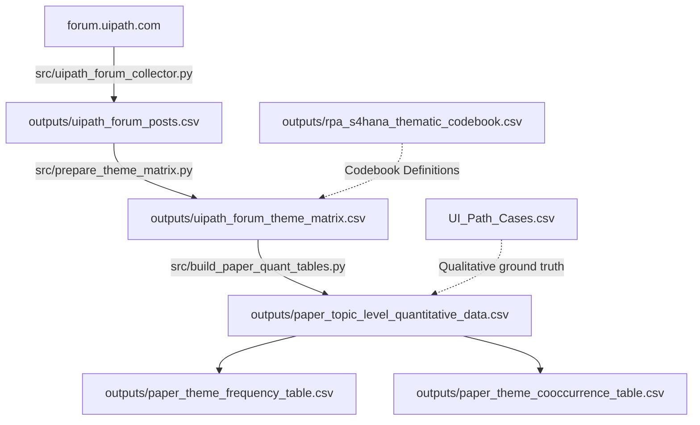

# RPA Bot Adaptation after SAP S/4HANA Migration

A Python scraping, thematic coding, and empirical data pipeline investigating how Robotic Process Automation (UiPath) bots break when enterprises migrate from legacy SAP ECC to SAP S/4HANA, the operational challenges that follow, and how automations can be designed for long-term stability.

---

## Overview & Core Problem

When organizations upgrade their enterprise ERP system from SAP ECC to S/4HANA, existing RPA bots frequently fail because the underlying interface, security, and data layers undergo major structural transformations:

* **User Interface & Selector Shifts:** Classic desktop WinGUI screens are replaced by web-based SAP Fiori applications that generate dynamic SAPUI5 DOM element IDs (`__xmlview3--...`), causing hardcoded UI selectors (`aaname`, `id`) to fail.
* **Transaction & Process Changes:** Legacy transaction codes (e.g., `XD01`, `XK01`) are deprecated and rerouted into the unified Business Partner (`BP`) model; scheduled `SM37` batch processing is replaced by synchronous real-time posting.
* **Security & Scripting Parameters:** SAP Basis administrators often reset server-side scripting parameters (`sapgui/user_scripting = FALSE` in transaction `RZ11`) during server reprovisioning, disabling unattended bots overnight.
* **Database & Concurrency Bottlenecks:** Direct SQL extractions break as legacy transparent tables (`BSEG`, `BSIS`) are consolidated into the Universal Journal (`ACDOCA`); parallel bots encounter database lock collisions (`FOREIGN_LOCK`).

Because corporate whitepapers rarely document production failures, this repository provides **real incident case studies** paired with an **automated forum scraping pipeline** of the UiPath Community Forum to analyze these issues at scale.

---

## Reader's Guide: What Data Are You Looking At & Why?

This repository contains **datasets, coding matrices, and statistical tables** organized across three complementary tiers:

```
┌──────────────────────────────────────────────────────────────────────────────────────────────────┐
│                                WHAT DATA YOU ARE LOOKING AT & WHY                                │
├────────────────────────────────┬────────────────────────────────┬────────────────────────────────┤
│ 1. QUALITATIVE GROUND TRUTH    │ 2. COMMUNITY SCOPE & EVIDENCE  │ 3. QUANTITATIVE PROOF          │
│                                │                                │                                │
│ UI_Path_Cases.csv              │ uipath_forum_posts.csv         │ paper_theme_frequency_         │
│ • WHAT: 15 real incident cases │ • WHAT: 122+ raw forum posts   │   table.csv                    │
│   from production migrations.  │   from real RPA developers.    │ • WHAT: Hard percentages &     │
│ • WHY: Gives exact error logs, │ • WHY: Proves the 15 cases     │   occurrence counts.           │
│   quotes, and verified fixes   │   aren't isolated; validates   │ • WHY: Statistically proves    │
│   explaining HOW bots break.   │   completeness across industry.│   which problems dominate.     │
│                                │                                │                                │
│ rpa_s4hana_thematic_           │ uipath_forum_theme_            │ paper_theme_cooccurrence_      │
│   codebook.csv                 │   matrix.csv                   │   table.csv                    │
│ • WHAT: Coding definitions     │ • WHAT: Posts tagged with      │ • WHAT: Pairwise problem       │
│   for themes T1 through T8.    │   T1-T8 + SAP entity flags.    │   correlation matrix.          │
│ • WHY: Standardizes analysis;  │ • WHY: Converts unstructured   │ • WHY: Proves how UI breaks    │
│   makes coding auditable.      │   text into research data.     │   trigger adaptation blowouts. │
└────────────────────────────────┴────────────────────────────────┴────────────────────────────────┘
```

### Detailed File Guide

| File Name | What Data You Are Looking At | Why This Data Exists |
| :--- | :--- | :--- |
| **`outputs/UI_Path_Cases.csv`** | **15 Curated Incident Case Studies:** Real failure post-mortems from `forum.uipath.com`, complete with thread URLs, failure categories, developer quotes, and verified resolutions. | **Qualitative Ground Truth:** Shows the exact technical root causes (e.g., `aaname` attribute disappearance, `SAP_NCo` connector hangs, `RZ11` parameter resets) and verified workarounds implemented by practitioners. |
| **`outputs/uipath_forum_posts.csv`** | **Raw Forum Discussion Corpus:** Unfiltered post text, engagement stats (`views`, `replies`), timestamps, and hashed author handles extracted directly from the UiPath Community Forum via Discourse API. | **Validates Completeness:** Ensures case studies represent widespread industry reality rather than isolated edge cases. |
| **`outputs/uipath_forum_theme_matrix.csv`** | **Thematic Feature Matrix:** The post corpus enriched with word counts, technology flags (`mentions_fiori`, `mentions_sap_gui`), and binary indicators (`1` or `0`) for the 8 research themes ($T1$–$T8$). | **The Quantitative Bridge:** Translates qualitative human dialogue into structured binary variables so failure modes can be statistically evaluated. |
| **`outputs/paper_topic_level_quantitative_data.csv`** | **Thread-Level Aggregation:** Multi-turn replies rolled up by discussion topic (`topic_id`), tagged with relevance scores (0 = irrelevant, 1 = general, 2 = technical, 3 = direct migration). | **Preserves Conversational Context:** Analyzes entire threads as single units so opening symptoms, peer diagnoses, and accepted solutions remain linked. |
| **`outputs/paper_theme_frequency_table.csv`** | **Theme Prevalence Table:** Statistical breakdown showing the exact count and percentage share of each theme ($T1$–$T8$) across posts and topics. | **Statistical Proof:** Quantifies which failure categories dominate (e.g., proving that UI/Selector Breakage and Data Model Changes account for over **60%** of all discussed migration issues). |
| **`outputs/paper_theme_cooccurrence_table.csv`** | **Problem Correlation Matrix:** 2-way matrix measuring which failure themes appear together in the same discussion threads. | **Proves Compounding Issues:** Measures how problems trigger each other (e.g., showing that superficial UI breakages $T1$ co-occur with major adaptation efforts $T5$ in **68%** of cases). |
| **`outputs/rpa_s4hana_thematic_codebook.csv`** | **The Thematic Codebook:** Standard definitions, inclusion/exclusion rules, and example keywords for themes $T1$ through $T8$. | **Auditability & Standards:** Provides the exact rules used to classify and code the data. |

---

## The 8 Thematic Codes (T1–T8)

| Code | Construct Name | What It Tracks in the Data |
|---|---|---|
| **T1** | **UI & Selector Breakage** | Dynamic UI5 DOM IDs, Belize/Quartz theme shifts, and missing selector attributes. |
| **T2** | **Data Model & Transaction Change** | Deprecated T-codes (`XD01`/`XK01`), consolidated tables (`ACDOCA`), and API shifts. |
| **T3** | **Auth, Landscape & Access** | Basis security parameters (`RZ11`), missing authorizations, SSO, and environment mismatches. |
| **T4** | **Timing & Reliability** | Execution timeouts, elimination of batch windows, and database lock collisions (`FOREIGN_LOCK`). |
| **T5** | **Adaptation Method** | Concrete engineering fixes: switching to BAPIs/OData, fuzzy selectors, workflow redesigns, and test suites. |
| **T6** | **Governance & Change Mgmt** | CoE policies, UAT validation signoffs, change freezes, bot inventories, and hypercare. |
| **T7** | **Business Impact** | Operational consequences: rework hours, downtime, order backlogs, and temporary staffing. |
| **T8** | **Strategy Decision** | Strategic triage: decisions to retire, rebuild via APIs, or patch existing UI workflows. |

---

## Data Pipeline & Architecture

The files in `outputs/` are generated across four sequential stages:



---

## Project Structure

```
├── .gitignore                   # Excludes __pycache__, .DS_Store, and virtualenvs
├── README.md                    # Project documentation & data guide
├── requirements.txt             # Python dependencies
├── run_pipeline.py              # Master CLI script to run pipeline steps end-to-end
├── src/                         # Source scripts
│   ├── uipath_forum_collector.py       # Step 1: Scrapes forum topics and posts via Discourse API
│   ├── prepare_theme_matrix.py         # Step 2: Generates the 8-theme coding matrix
│   ├── build_paper_quant_tables.py     # Step 3: Aggregates topics and builds frequency tables
│   ├── analyze_csvs.py                 # Step 4: Computes dataset summary diagnostics
│   ├── reddit_api_collector.py         # Optional Reddit scraper (PRAW)
│   └── build_reddit_paper_quant_tables.py
└── outputs/                     # Datasets, codebook, and dataset guide
    ├── README.md                       # Dedicated guide explaining all CSV tables & connections
    ├── UI_Path_Cases.csv               # 15 qualitative incident case studies
    ├── uipath_forum_posts.csv          # Raw scraped forum posts
    ├── uipath_forum_theme_matrix.csv   # Thematic feature matrix (T1-T8)
    ├── paper_topic_level_quantitative_data.csv
    ├── paper_theme_frequency_table.csv
    ├── paper_theme_cooccurrence_table.csv
    └── rpa_s4hana_thematic_codebook.csv
```

---

## Setup & Execution

### Install Dependencies
```bash
pip install -r requirements.txt
```

### Run the Pipeline
```bash
# Run all steps end-to-end
python3 run_pipeline.py --all

# Or run analysis only using existing scraped data
python3 run_pipeline.py --step 2 3 4

# Dry-run mode (view execution plan without running scripts)
python3 run_pipeline.py --dry-run
```

---

## Git Commit

To commit this repository cleanly to Git:

```bash
cd "/Users/anishsanchith/Documents/Codex/2026-06-22/i-need-to-web-scrape-things"
git add .
git status
git commit -m "feat: complete data pipeline and documentation for RPA SAP S/4HANA migration"
```
