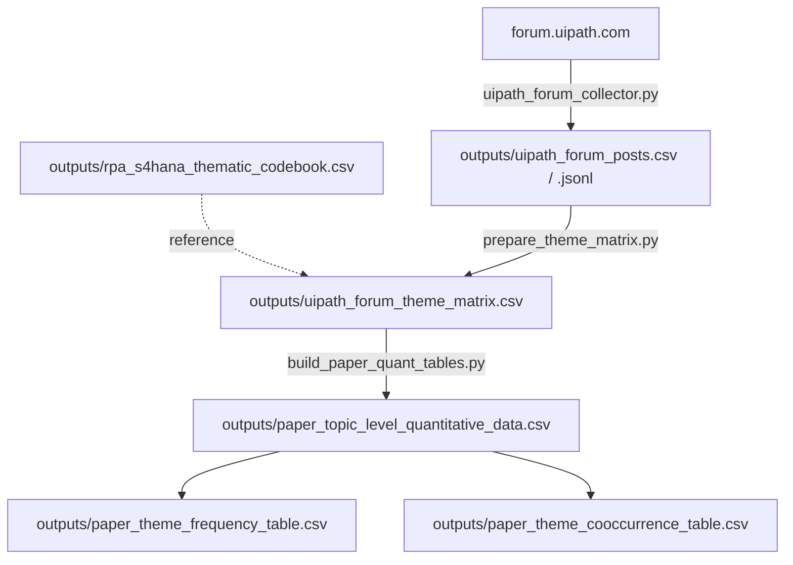

# RPA Bot Resilience During SAP S/4HANA Migration

This repository collects public UiPath Community Forum discussions about SAP S/4HANA and RPA, then organises them for review. The separate research-design document covers the research questions and interpretation.

## What this project is for

**When people discuss UiPath and SAP S/4HANA together, what are they talking about?** The project keeps the source posts and links, adds keyword-based theme flags, and groups posts by topic.

## Collection contract

These are the settings used by `python3 run_pipeline.py --all`.

| Decision | Current implementation | Why / boundary |
| :--- | :--- | :--- |
| **Primary source** | UiPath Community Forum, queried through its public Discourse JSON endpoints. | It is a focused practitioner venue for UiPath implementation and troubleshooting discussions, including context that is rarely available from enterprise production systems. |
| **Supplementary source** | None in the default run. `src/reddit_api_collector.py` is optional comparison code and requires Reddit credentials. | Reddit is not combined with the checked-in UiPath dataset and should not be described as part of the primary sample. |
| **Access and ethics** | Requests target public JSON endpoints; no login or private areas are used. Usernames are replaced with short SHA-256 hashes. | Check robots.txt and terms, use conservative delays, and review text for sensitive data. These checks are operator responsibilities; the code does not enforce or redact them. |
| **Query** | `"SAP S/4HANA" "UiPath"` | Requiring both exact phrases keeps the default retrieval focused on the intersection of the SAP platform and UiPath. |
| **Search depth** | Five search-result pages (`--pages 5`). | This is a bounded, reproducible slice of the forum search results rather than a claim of exhaustive coverage. |
| **Topic depth** | One JSON request per discovered topic; the posts returned in that response are written. | The collector does not paginate a topic stream, so a long topic may be incomplete. |
| **Date range** | No date filter is applied. The checked-in snapshot spans 2019-03-06 to 2026-06-16 UTC (122 posts across 37 topics). | Those dates describe the current snapshot only; reruns can change as the forum index changes. |
| **Collection frequency** | Manual, one-off execution. There is no scheduler or incremental-update mechanism. | A rerun overwrites the raw CSV/JSONL and does not create a provenance manifest. |

### Query configuration note

Use `run_pipeline.py` for the documented dataset. The collector’s direct defaults differ (five queries and two pages), so pass its arguments explicitly when running it alone.

## How filtering and keyword decisions work

Filtering happens in four stages:

1. **Retrieval.** The forum search requires both `"SAP S/4HANA"` and `"UiPath"`. All posts returned for discovered topics are written to the raw files.
2. **Deduplication.** A repeated `post_id` is kept once.
3. **Relevance triage.** `build_paper_quant_tables.py` assigns a 0–3 topic score from migration, S/4HANA, SAP-technology, and vendor-context terms. This separates direct migration discussions from weaker context.
4. **Theme suggestions.** `prepare_theme_matrix.py` sets a theme flag when a configured keyword appears in a title or post. The flags identify records for review; they are not confirmed codes.

### Fields collected and why

| Field | Purpose |
| :--- | :--- |
| `source`, `query` | Preserve where the record came from and which retrieval rule found it. |
| `topic_id`, `post_id`, `url` | Stable traceability back to the forum topic and individual post. |
| `title` | Topic context for screening and review. |
| `created_at` | Temporal description of the observed discussions. It is not used as a collection filter. |
| `author_hash` | Allows repeated authors to be recognised without storing the plaintext username. It is not an identity claim. |
| `reply_count`, `views`, `like_count` | Available engagement/context fields. They are topic-level values repeated on each post; `like_count` is blank in the current snapshot. |
| `text` | The content screened for themes and manual review. It may contain promotional, off-topic, or sensitive material from the public source. |

## Processing flow

The default pipeline has three stages:

1. `src/uipath_forum_collector.py` retrieves public forum topics and posts into `outputs/uipath_forum_posts.csv` and `.jsonl`.
2. `src/prepare_theme_matrix.py` adds technology mentions, word counts, and binary keyword-suggestion columns for themes T1–T8.
3. `src/build_paper_quant_tables.py` groups posts by topic and writes the derived CSV tables.

`outputs/rpa_s4hana_thematic_codebook.csv` documents the intended theme definitions and inclusion/exclusion guidance. The executable keyword rules remain in `prepare_theme_matrix.py`.

Files named `paper_*` are retained output filenames for derived CSV tables. The default pipeline does not generate a prose results report.

## What the theme columns represent

Each theme column is a binary review flag. Together, the themes cover the problem, response, organisational context, impact, and decision dimensions of a discussion:

| Code | Theme | Why it is included |
| :--- | :--- | :--- |
| T1 | UI and selector breakage | Identifies interface changes that can break automations. |
| T2 | Data model and transaction changes | Captures changed transactions, fields, tables, or APIs. |
| T3 | Authentication, authorisation, and access | Captures login, role, certificate, and environment barriers. |
| T4 | Timing, performance, and reliability | Captures timeouts, instability, and runtime failures. |
| T5 | Adaptation methods | Records the technical methods used to adapt or repair bots. |
| T6 | Governance and change management | Records organisational controls around migration and bot changes. |
| T7 | Business impact | Captures operational consequences or measurable benefits. |
| T8 | Adaptation strategy decisions | Captures decisions to retain, refactor, rebuild, replace, or retire a bot. |



## Project structure

```
├── README.md                         # Collection contract, structure, and limitations
├── outputs/README.md                 # Data dictionary for generated files
├── requirements.txt                  # Python dependencies
├── run_pipeline.py                   # Default three-stage runner
└── src/
    ├── uipath_forum_collector.py     # Primary UiPath forum collector
    ├── prepare_theme_matrix.py       # Keyword-suggestion matrix
    ├── build_paper_quant_tables.py   # Topic and theme CSV tables
    ├── reddit_api_collector.py       # Optional Reddit collector
    └── build_reddit_paper_quant_tables.py # Optional Reddit-derived tables
```


## Setup and execution

```bash
pip install -r requirements.txt

# Run the documented collection and processing flow
python3 run_pipeline.py --all

# Rebuild derived files from the existing raw collection
python3 run_pipeline.py --step 2 3

# Display the execution plan without making requests
python3 run_pipeline.py --dry-run
```
